# Exact-and-approximate-triangle-counting-algorithms

In this project, we focus on exact and approximate triangle counting algorithms. The goal is to implement and compare various triangle counting algorithms. The implemented algorithms include exact algorithms such as:

1. **All Triplets**
2. **Node Iterator**
3. **Compact Forward**

Additionally, the project involves implementing the DOULION algorithm, which sparsifies the graph, allowing for approximate triangle counting using any of the aforementioned exact algorithms. Finally, a streaming algorithm for incremental graph edge processing will be implemented, specifically focusing on the TRIEST algorithm for edge insertions only (edge deletions will not be implemented).

## Table of Contents

- [Overview](#overview)
- [Libraries](#Libraries)
- [Graph Datasets](#Graph-datasets)
- [Exact Algorithms](#exact-algorithms)
  - [All Triplets](#all-triplets)
  - [Node Iterator](#node-iterator)
  - [Compact Forward](#compact-forward)
- [Approximate Algorithm](#approximate-algorithm)
  - [DOULION](#doulion)
- [Streaming Algorithm](#streaming-algorithm)
  - [TRIEST for Edge Insertions](#triest-for-edge-insertions)
- [Usage](#usage)
- [Contributing](#contributing)
- [License](#license)

## Overview

This project focuses on implementing and comparing various exact and approximate triangle counting algorithms. The aim is to provide a comprehensive analysis of their performance and efficiency in different scenarios.

## Libraries

The following libraries are utilized for different aspects of the project:

- [networkx](https://networkx.github.io/): A Python library for creating, analyzing, and visualizing complex networks (graphs).
- [io](https://docs.python.org/3/library/io.html): Input/output utilities.
- [numpy](https://numpy.org/): Numerical computing library for working with arrays.
- [pandas](https://pandas.pydata.org/): Data manipulation and analysis library.
- [itertools](https://docs.python.org/3/library/itertools.html): Module that provides various functions that work on iterators to produce complex iterators.
- [scipy](https://www.scipy.org/): Library used for scientific computing and technical computing. The specific submodule [csr_matrix](https://docs.scipy.org/doc/scipy/reference/generated/scipy.sparse.csr_matrix.html) from SciPy is utilized for compressed sparse row matrix operations.
- [matplotlib](https://matplotlib.org/): Plotting library for creating visualizations.
- [time](https://docs.python.org/3/library/time.html): Module for dealing with time-related tasks.
  
```
import networkx as networkx #A Python library for creating, analyzing, and visualizing complex networks (graphs).
import io #Input/output utilities.
import numpy as np #Numerical computing library for working with arrays.
import pandas as pd #Data manipulation and analysis library.
import itertools #Module that provides various functions that work on iterators to produce complex iterators
from scipy.sparse import csr_matrix #Compressed Sparse Row matrix from SciPy, useful for sparse matrix operations
import matplotlib.pyplot as plt #Plotting library.
import time #Module for dealing with time-related tasks.
!pip install 'scipy>=1.8' #Python library used for scientific computing and technical computing
```
## Graph Datasets

In this project, we utilize graph datasets from the Stanford Network Analysis Project (SNAP). The following datasets are used:

- [CA-CondMat](http://snap.stanford.edu/data/ca-CondMat.html): A co-authorship network of Condensed Matter Physics papers.

- [com-amazon.ungraph](http://snap.stanford.edu/data/com-Amazon.html): The Amazon product co-purchasing network.

- [facebook_combined](http://snap.stanford.edu/data/ego-Facebook.html): Facebook social circles.
  
- [roadNet-CA](http://snap.stanford.edu/data/roadNet-CA.html): A road network from California.

- [WikiTalk](http://snap.stanford.edu/data/wiki-Talk.html): The communication network on Wikipedia.

## Creating Graphs

```
# Assuming 'uploaded' is correctly populated
g1 = nx.read_edgelist(io.BytesIO(uploaded["facebook_combined.txt"]), create_using=nx.Graph(), nodetype=int)
g2 = nx.read_edgelist(io.BytesIO(uploaded["CA-CondMat.txt"]), create_using=nx.Graph(), nodetype=int)
g3 = nx.read_edgelist(io.BytesIO(uploaded["com-amazon.ungraph.txt"]), create_using=nx.Graph(), nodetype=int)
g4 = nx.read_edgelist(io.BytesIO(uploaded["roadNet-CA.txt"]), create_using=nx.Graph(), nodetype=int)
```

## Removing Self-loops
Removing any self-loops from the graphs. Self-loops are edges that connect a node to itself.
```
g1.remove_edges_from(networkx.selfloop_edges(g1))
g2.remove_edges_from(networkx.selfloop_edges(g2))
g3.remove_edges_from(networkx.selfloop_edges(g3))
g4.remove_edges_from(networkx.selfloop_edges(g4))
```
## Calculating Triangles in the Graph
Calculating the number of triangles in the graphs using NetworkX's triangles function.
It sums up the triangle counts for each node and then divides by 3, as each triangle is counted three times in an undirected graph.
```
triangles_g1 = sum(networkx.triangles(g1).values()) / 3
print("The number of triangles on graph g1 are",int(triangles_g1))
triangles_g2 = sum(networkx.triangles(g2).values()) / 3
print("The number of triangles on graph g2 are",int(triangles_g2))
triangles_g3 = sum(networkx.triangles(g3).values()) / 3
print("The number of triangles on graph g3 are",int(triangles_g3))
triangles_g4 = sum(networkx.triangles(g4).values()) / 3
print("The number of triangles on graph g4 are",int(triangles_g4))
```

## Exact Algorithms

### All Triplets

It directly iterates through all triplets of nodes and checks if there's an edge between each pair, effectively counting triangles.

```
def all_triplets(g):
    start_time = time.process_time()

    triangles = 0

    for node1 in g.nodes():
        for node2 in g.neighbors(node1):
            for node3 in g.neighbors(node2):
                if g.has_edge(node1, node3):
                    triangles += 1

    triangles = triangles // 6 # Divide by 6 to account for counting each triangle six times

    end_time = (time.process_time() - start_time)

    return triangles, end_time
```
Printing the results.

```
All_Triangles_g1, All_Triangles_g1_time = all_triplets(g1)
print("The number of triangles that brute force algorithm has found on graph g1 are",All_Triangles_g1)
print("Total runtime for graph g1:",All_Triangles_g1_time)

All_Triangles_g2, All_Triangles_g2_time = all_triplets(g2)
print("The number of triangles that brute force algorithm has found on graph g2 are",All_Triangles_g2)
print("Total runtime for graph g2:",All_Triangles_g2_time)

All_Triangles_g3, All_Triangles_g3_time = all_triplets(g3)
print("The number of triangles that brute force algorithm has found on graph g3 are",All_Triangles_g3)
print("Total runtime for graph g3:",All_Triangles_g3_time)

All_Triangles_g4, All_Triangles_g4_time = all_triplets(g4)
print("The number of triangles that brute force algorithm has found on graph g4 are",All_Triangles_g4)
print("Total runtime for graph g4:",All_Triangles_g4_time)
```

### Node Iterator

Computing the number of triangles in a graph g using a Node Iterator algorithm.
This algorithm checks each node to see if it forms any triangles with its neighbors.

```
def node_iterator(g):

  start_time = time.process_time()
  nodes = networkx.nodes(g)
  triangles=0
  for node in nodes: #for all nodes
    bors = list(networkx.neighbors(g,node)) #It gets the neighbors of each node.
    if len(bors)>1:
      for pair in itertools.combinations(bors,r=2): #For each node, it checks all combinations of two neighbors.
        if pair[0] in list(networkx.neighbors(g,pair[1])): #It checks if the selected pair of neighbors are also connected.
          triangles=triangles+1

  end_time = (time.process_time() - start_time)
  return int(triangles/3), end_time
```
Printing the results.

```
NodeIterTriangles_g1, NodeIterTriangles_g1_time = node_iterator(g1)
print("The number of triangles that NodeIterator has found for graph g1 are",NodeIterTriangles_g1)
print("Time needed for NodeIterator to run for graph g1:", NodeIterTriangles_g1_time)

NodeIterTriangles_g2, NodeIterTriangles_g2_time = node_iterator(g2)
print("The number of triangles that NodeIterator has found for graph g2 are",NodeIterTriangles_g2)
print("Time needed for NodeIterator to run for graph g2:", NodeIterTriangles_g2_time)

NodeIterTriangles_g4, NodeIterTriangles_g4_time = node_iterator(g4)
print("The number of triangles that NodeIterator has found for graph g4 are",NodeIterTriangles_g4)
print("Time needed for NodeIterator to run for graph g4:", NodeIterTriangles_g4_time)

NodeIterTriangles_g3, NodeIterTriangles_g3_time = node_iterator(g3)
print("The number of triangles that NodeIterator has found for graph g3 are",NodeIterTriangles_g3)
print("Time needed for NodeIterator to run for graph g3:", NodeIterTriangles_g3_time)
```


### Compact Forward

Computes the number of triangles in a graph graph using a Compact Forward algorithm.
This algorithm does not require additional space to store the neighbors of every node dynamically.

```
def c_forward(graph):

    start_time = time.process_time()
    #Initializing variables for counting triangles
    triangles = 0
    vertices = graph.nodes()
    degrees = [graph.degree(v) for v in vertices]
    #Sorting nodes based on decreasing order of degree.
    sorted_degrees, sorted_vertices = zip(*sorted(zip(degrees,vertices), reverse=True))
    sorted_degrees, sorted_vertices =np.array(sorted_degrees), np.array(sorted_vertices)
    vertices_dictionary = dict(zip(sorted_vertices, range(len(sorted_vertices)))) #dict node_id:index
    i = 0
    for v in sorted_vertices:

        neighbors = list(graph.neighbors(v)) #Getting the neighbors of each node.
        if len(neighbors)>0:
            #Calculating the degree of each vertex in the neighbors list and then sorting the vertices based on their degrees in descending order.
            neighbors_degrees = [graph.degree(v) for v in neighbors]
            sorted_neighbors_degrees, sorted_vertices_neighbors = zip(*sorted(zip(neighbors_degrees,neighbors), reverse=True))
            idx_base  = i
            #if the smallest degree is higher than v's degree, ignore
            idx_check = vertices_dictionary [sorted_vertices_neighbors[-1]]
            if idx_check>idx_base:
              # Setting the base index idx_base and checks if the last vertex (sorted_vertices_neighbors[-1]) has a higher index (idx_check) than the base index.
              #If true, it filters the vertices in sorted_vertices_neighbors to keep only those with an index greater than idx_base.

                neibh = filter(lambda item: vertices_dictionary[item] > idx_base, sorted_vertices_neighbors)
                for u in neibh: #keep only neighbors with lower degree
                    u_neighbors = list(graph.neighbors(u))
                    u_neighbors_degrees = [graph.degree(i) for i in u_neighbors]
                    _, sorted_neighbors_u = zip(*sorted(zip(u_neighbors_degrees,u_neighbors), reverse=True))
                    u1 = sorted_neighbors_u[0]  #first  neighbor of u
                    v1 = sorted_vertices_neighbors[0] #first neighbor of v
                    c_u = 0 #counter for neighbors of u
                    c_v = 0 #counter for neighbors of v
                    idx_candid1 = vertices_dictionary[u1]
                    idx_candid2 = vertices_dictionary[v1]
                   #It iterates through the filtered neighbors (neib) and sorts their neighbors by degree.
                   #Nested loop that compares the degrees of neighbors (u1 and v1) and updates counters (c_u and c_v) and indices (idx_candid1 and idx_candid2) accordingly.
                   #The loop continues until either c_v or c_u reaches the end of their respective lists.
                    while (c_v<len(sorted_vertices_neighbors)-1) or (c_u<len(sorted_neighbors_u)-1):
                        if (idx_candid1<idx_base) & (idx_candid2<idx_base):
                            if idx_candid1<idx_candid2:
                                if c_u < len(sorted_neighbors_u)-1:
                                    c_u += 1
                                    u1 = sorted_neighbors_u[c_u]  #next neighbor of u
                                    idx_candid1 = vertices_dictionary[u1]
                                else:
                                    break
                            elif idx_candid1>idx_candid2:
                                if c_v < len(sorted_vertices_neighbors)-1:
                                    c_v += 1
                                    v1 = sorted_vertices_neighbors[c_v]
                                    idx_candid2 = vertices_dictionary[v1]
                                else:
                                    break
                            else:
                                triangles += 1
                                if c_u < len(sorted_neighbors_u)-1:
                                    c_u += 1
                                    u1 = sorted_neighbors_u[c_u]
                                    idx_candid1 = vertices_dictionary[u1]
                                if c_v < len(sorted_vertices_neighbors)-1:
                                    c_v += 1
                                    v1 = sorted_vertices_neighbors[c_v]
                                    idx_candid2 = vertices_dictionary[v1]
                        else:
                            break
        i+=1
    end_time = (time.process_time() - start_time)
    return triangles, end_time
```

Printing the results.
```
cForwardTriangles_g1, cForwardTriangles_g1_time = c_forward(g1)
print("The number of triangles that Compact Forward has found for graph g1 are",cForwardTriangles_g1)
print("time needed for Compact Forward to run for graph g1:", cForwardTriangles_g1_time)

cForwardTriangles_g2, cForwardTriangles_g2_time = c_forward(g2)
print("The number of triangles that Compact Forward has found for graph g2 are",cForwardTriangles_g2)
print("time needed for Compact Forward to run for graph g2:", cForwardTriangles_g2_time)

cForwardTriangles_g3, cForwardTriangles_g3_time = c_forward(g3)
print("The number of triangles that Compact Forward has found for graph g3 are",cForwardTriangles_g3)
print("time needed for Compact Forward to run for graph g3:", cForwardTriangles_g3_time)

cForwardTriangles_g4, cForwardTriangles_g4_time = c_forward(g4)
print("The number of triangles that Compact Forward has found for graph g4 are",cForwardTriangles_g4)
print("time needed for Compact Forward to run for graph g4:", cForwardTriangles_g4_time)
```


## Approximate Algorithm

### DOULION

Sparsifying the input graph g by randomly removing edges based on a sparsity parameter p.

```
def sparsify_graph(g, p):

    g_sparse = networkx.Graph()
    for u,v in g.edges():
        if np.random.random() <= p:
            g_sparse.add_edge(u,v)
    return g_sparse
```

Implementing the DOULION algorithm, which sparsifies the graph, applies both Compact Forward and Node Iterator algorithms.
It also computes related errors, accuracy, and speedups. It runs the process for different sparsity values (p) and repeats each experiment 10 times.

```
def doulion(g, time_cf, time_ni):
#This function takes three parameters: the input graph g, and the execution times for Compact Forward (time_cf) and Node Iterator (time_ni).
#It initializes lists to store the average related error (rel_err_avg), average accuracy (acc_avg), Compact Forward speedup (dcf_speedup),
#Node Iterator speedup (dni_speedup), Node Iterator speedup (speedup_ni), and Compact Forward speedup (speedup_cf).
  rel_err_avg, acc_avg, dcf_speedup, dni_speedup, speedup_ni, speedup_cf = [], [], [], [], [], []
#This loop iterates over different sparsity levels p (0.1, 0.3, 0.5, 0.7, 0.9)
  for p in [0.1, 0.3, 0.5, 0.7, 0.9]:
#For each sparsity level p, it initializes empty lists to store accuracy and related error values for Compact Forward and Node Iterator.
      acc_cf, rel_err_cf, acc_NIt, rel_err_NIt = [], [], [], []
      for i in range(10): #Runs the following block of code 10 times.
          start_time = time.process_time()
          graph = sparsify_graph(g, p)  #Sparsify graph
          time_doul = (time.process_time() - start_time) #Time taken for sparsification
          time_start_dcf = time.process_time() #Starting time for Compact Forward on sparsified graph
          triangles_cf,_ = c_forward(graph) #run compact forward
          triangles_cf_final = triangles_cf/p**3
          time_dcf = (time.process_time() - time_start_dcf + time_doul)
          speedup_cf.append(time_cf/time_dcf) #compute speedup for Compact Forward
          triangles_networkx = sum(networkx.triangles(g).values()) / 3
          #It computes the accuracy for Compact Forward and appends it to the acc_cf list.
          #If the computed value exceeds the actual number of triangles in the original graph (triangles_nx), it adjusts the accuracy accordingly.
          if triangles_cf_final <= triangles_networkx:
            acc_cf.append(triangles_cf_final/triangles_networkx)
          else:
            num = triangles_networkx-(triangles_cf_final-triangles_networkx)
            acc_cf.append(num/triangles_networkx)
          #It computes the related error for Compact Forward and appends it to the rel_err_cf list.
          rel_err_CF = abs((triangles_cf_final-triangles_networkx)/triangles_networkx)
          rel_err_cf.append(rel_err_CF)

          time_start_dni = time.process_time() #Starting time for Node Iterator on sparsified graph
          triangles_NIt,_ = node_iterator(graph) #run NodeIterator
          triangles_NIt_final = triangles_NIt/p**3
          time_dni = (time.process_time() - time_start_dni  + time_doul)
          time_dni = (time.process_time() - time_start_dni)
          speedup_ni.append(time_ni/time_dni) #compute speedup for Node Iterator
          #It computes the accuracy for Node Iterator and appends it to the acc_NIt list.
          #If the computed value exceeds the actual number of triangles in the original graph (triangles_nx), it adjusts the accuracy accordingly.
          if triangles_NIt_final <= triangles_networkx:
            acc_NIt.append(triangles_NIt_final/triangles_networkx)
          else:
            num = triangles_networkx-(triangles_NIt_final-triangles_networkx)
            acc_NIt.append(num/triangles_networkx)
          #It computes the related error for Node Iterator and appends it to the rel_err_NIt list.
          rel_err_nit = abs((triangles_NIt_final-triangles_networkx)/triangles_networkx)
          rel_err_NIt.append(rel_err_nit)
      #After running the experiments for a specific sparsity level p for 10 times, it calculates the average related error, average accuracy,
      #Compact Forward speedup, and Node Iterator speedup. These averages are then appended to their respective lists.
      rel_err_avg.append(np.mean(rel_err_cf))
      acc_avg.append(np.mean(acc_cf))
      dcf_speedup.append(np.mean(speedup_cf))
      dni_speedup.append(np.mean(speedup_ni))
      #Prints the mean related error, mean accuracy, and standard deviations for both Compact Forward and Node Iterator for the current sparsity level p.
      print('for CF & p=',p, 'mean related error is: ', np.mean(rel_err_cf), 'accuracy is ', np.mean(acc_cf))
      print('for NI & p=',p,'mean related error is: ', np.mean(rel_err_NIt), 'accuracy is ', np.mean(acc_NIt))
      print('for p=',p, 'std of related error is: ', np.std(rel_err_NIt),'std of accuracy is ', np.std(acc_NIt))
      print('-------------------------------------------------------------------------------------------------')
      #Returns the lists containing average related error, average accuracy, Compact Forward speedup, and Node Iterator speedup for all sparsity levels.
  return rel_err_avg, acc_avg, dcf_speedup, dni_speedup
```

Printing the results.
```
rel_err_g1, acc_g1, dcf_speedup_g1, dni_speedup_g1 = doulion(g1, cForwardTriangles_g1_time, NodeIterTriangles_g1_time)
print(dcf_speedup_g1, dni_speedup_g1)

rel_err_g2, acc_g2, dcf_speedup_g2, dni_speedup_g2 = doulion(g2, cForwardTriangles_g2_time, NodeIterTriangles_g2_time)
print(dcf_speedup_g2, dni_speedup_g2)

rel_err_g3, acc_g3, dcf_speedup_g3, dni_speedup_g3 = doulion(g3, cForwardTriangles_g3_time, NodeIterTriangles_g3_time)
print(dcf_speedup_g3, dni_speedup_g3)

rel_err_g4, acc_g4, dcf_speedup_g4, dni_speedup_g4 = doulion(g4, cForwardTriangles_g4_time, NodeIterTriangles_g4_time)
print(dcf_speedup_g4, dni_speedup_g4)

```

## Plotting Metrics
Creating plots of speedup-accuracy.
```
def createplot_accuracy(accuracy, speedup, alg, custom_labels):
  plt.figure(figsize=(8, 5))
  plt.scatter(accuracy,speedup)

    # Add custom labels to points
  if custom_labels:
    for label, x, y in zip(custom_labels, accuracy, speedup):
        # Adjust the coordinates for a bit down and to the right
        adjusted_x = x + 0.0005  # You can adjust this value based on your preference
        adjusted_y = y - 0.0005  # You can adjust this value based on your preference
        plt.text(adjusted_x, adjusted_y, label, fontsize=12, ha='left', va='top')
  plt.scatter
  plt.xlabel('Accuracy', fontsize=16)
  plt.ylabel("Speedup", fontsize=16)
  plt.title(alg, fontsize=18)
  plt.xticks(fontsize=14)
  plt.yticks(fontsize=14)
  plt.savefig(alg+"_GRQC.png", bbox_inches='tight',dpi=300) #saving the current figure (plot) as an image file.
  #plt.savefig(alg+"_roadCA.png", bbox_inches='tight',dpi=300)
  #plt.savefig(alg+"_CondMat.png", bbox_inches='tight',dpi=300)
  plt.show()
```
```
custom_labels = ['P=0.1', 'P=0.3', 'P=0.5','P=0.7','P=0.9']
createplot_accuracy(acc_g1, dni_speedup_g1, 'Doulion And Node Iterator for G1',custom_labels) #plot speedup for NodeIterator
createplot_accuracy(acc_g1, dcf_speedup_g1, 'Doulion And Compact Forward for G1',custom_labels) #plot speedup for Compact Forward
createplot_accuracy(acc_g2, dni_speedup_g2, 'Doulion And Node Iterator for G2',custom_labels) #plot speedup for NodeIterator
createplot_accuracy(acc_g2, dcf_speedup_g2, 'Doulion And Compact Forward for G2',custom_labels) #plot speedup for Compact Forward
createplot_accuracy(acc_g3, dni_speedup_g3, 'Doulion And Node Iterator for G3',custom_labels) #plot speedup for NodeIterator
createplot_accuracy(acc_g3, dcf_speedup_g3, 'Doulion And Compact Forward for G3',custom_labels) #plot speedup for Compact Forward
createplot_accuracy(acc_g4, dni_speedup_g4, 'Doulion And Node Iterator for G4',custom_labels) #plot speedup for NodeIterator
createplot_accuracy(acc_g4, dcf_speedup_g4, 'Doulion And Compact Forward for G4',custom_labels) #plot speedup for Compact Forward
```

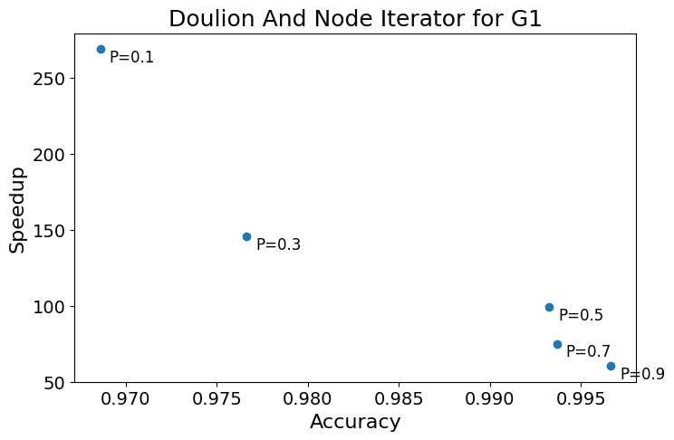
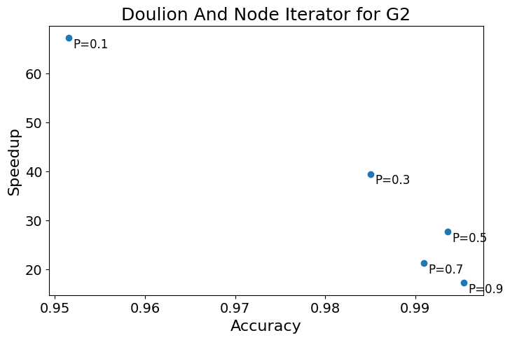
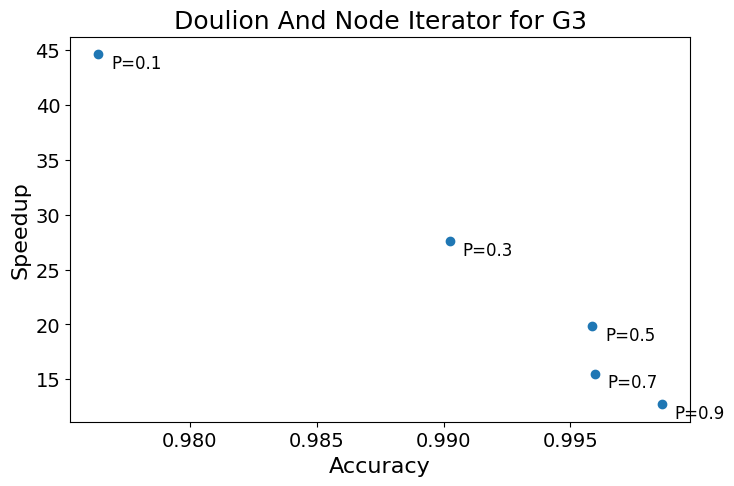
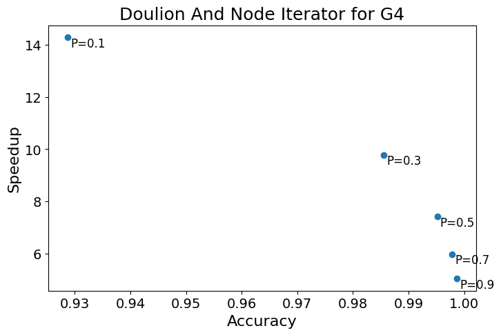

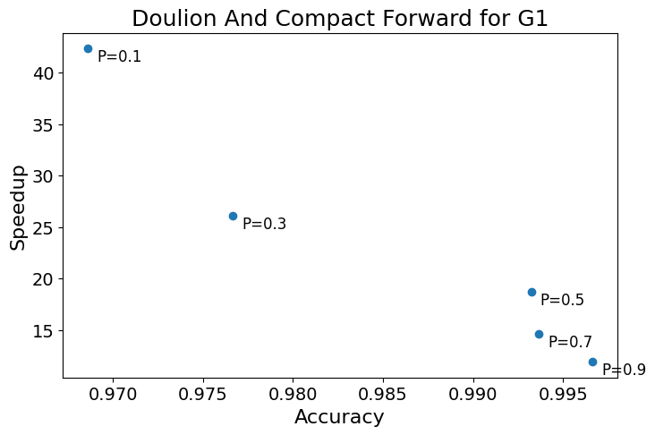
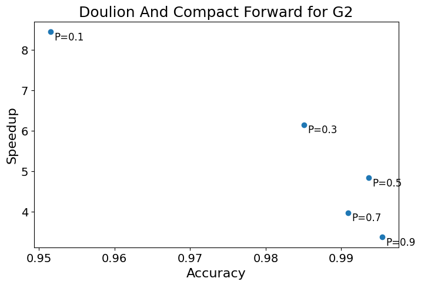
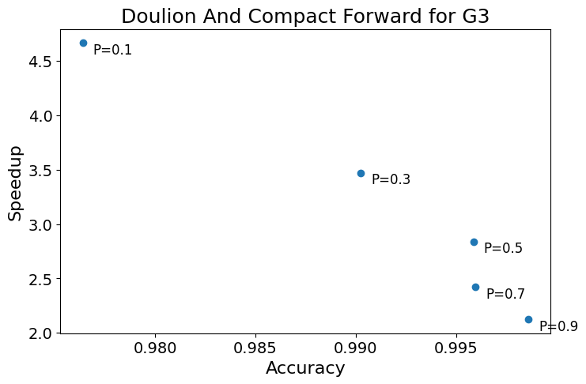
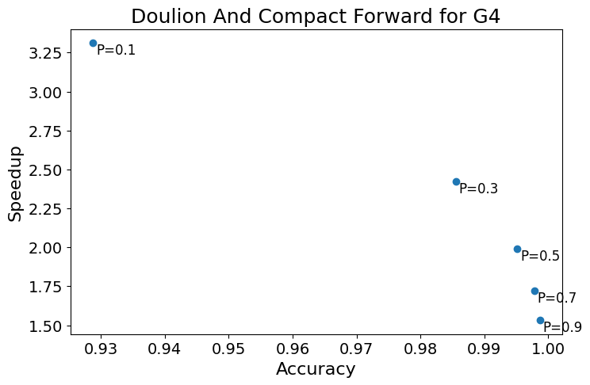

Creating plots of speedup-related error.

```
def createplot_related_error(rel_error, speedup, alg, custom_labels):
  plt.figure(figsize=(8, 5))
  plt.scatter(rel_error,speedup)

    # Add custom labels to points
  if custom_labels:
    for label, x, y in zip(custom_labels, rel_error, speedup):
        # Adjust the coordinates for a bit down and to the right
        adjusted_x = x + 0.0005  # You can adjust this value based on your preference
        adjusted_y = y - 0.0005  # You can adjust this value based on your preference
        plt.text(adjusted_x, adjusted_y, label, fontsize=12, ha='left', va='top')
  plt.scatter
  plt.xlabel('Related_Error', fontsize=16)
  plt.ylabel("Speedup", fontsize=16)
  plt.title(alg, fontsize=18)
  plt.xticks(fontsize=14)
  plt.yticks(fontsize=14)
  plt.savefig(alg+"_GRQC.png", bbox_inches='tight',dpi=300) #saving the current figure (plot) as an image file.
  #plt.savefig(alg+"_roadCA.png", bbox_inches='tight',dpi=300)
  #plt.savefig(alg+"_CondMat.png", bbox_inches='tight',dpi=300)
  plt.show()
```

```
createplot_related_error(rel_err_g1, dni_speedup_g1, 'Doulion And Node Iterator for G1',custom_labels) #plot speedup for NodeIterator
createplot_related_error(rel_err_g1, dcf_speedup_g1, 'Doulion And Compact Forward for G1',custom_labels) #plot speedup for Compact Forward
createplot_related_error(rel_err_g2, dni_speedup_g2, 'Doulion And Node Iterator for G2',custom_labels) #plot speedup for NodeIterator
createplot_related_error(rel_err_g2, dcf_speedup_g2, 'Doulion And Compact Forward for G2',custom_labels) #plot speedup for Compact Forward
createplot_related_error(rel_err_g3, dni_speedup_g3, 'Doulion And Node Iterator for G3',custom_labels) #plot speedup for NodeIterator
createplot_related_error(rel_err_g3, dcf_speedup_g3, 'Doulion And Compact Forward for G3',custom_labels) #plot speedup for Compact Forward
createplot_related_error(rel_err_g4, dni_speedup_g4, 'Doulion And Node Iterator for G4',custom_labels) #plot speedup for NodeIterator
createplot_related_error(rel_err_g4, dcf_speedup_g4, 'Doulion And Compact Forward for G4',custom_labels) #plot speedup for Compact Forward
```

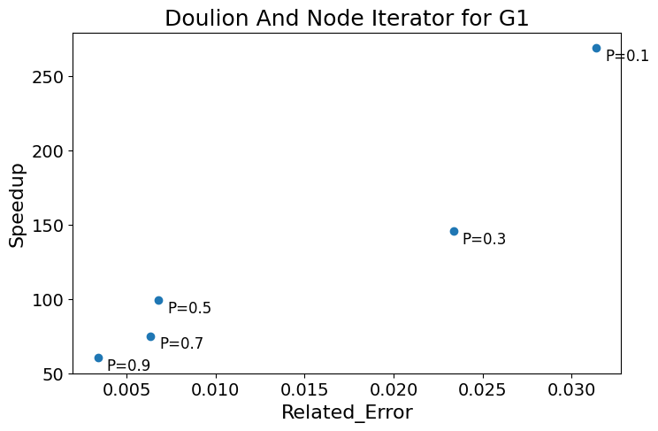
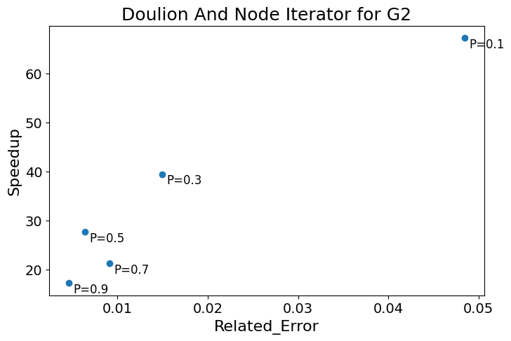
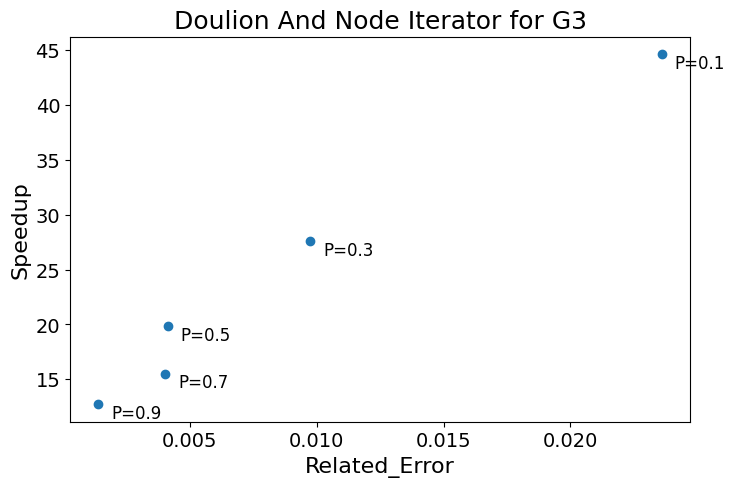
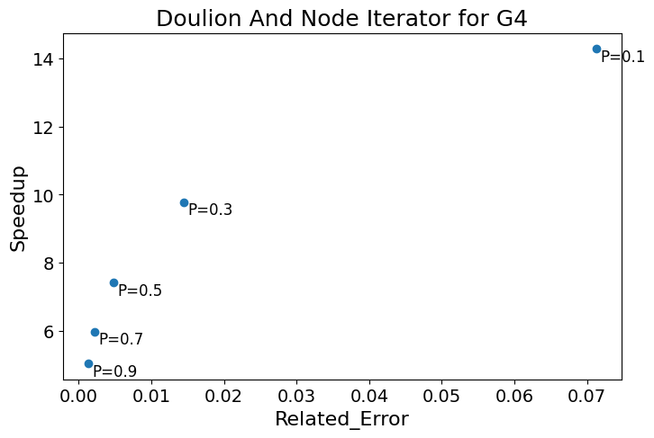

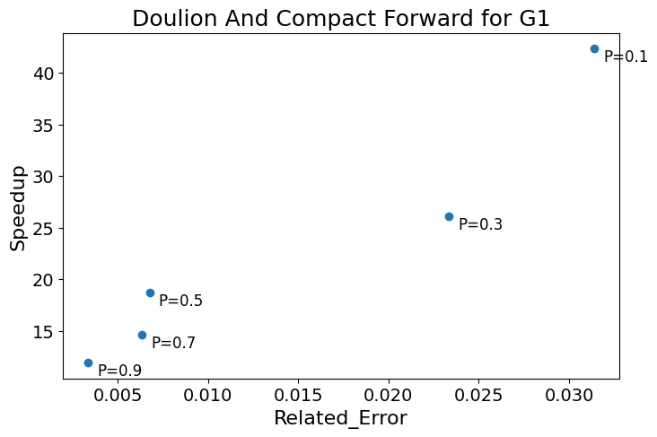
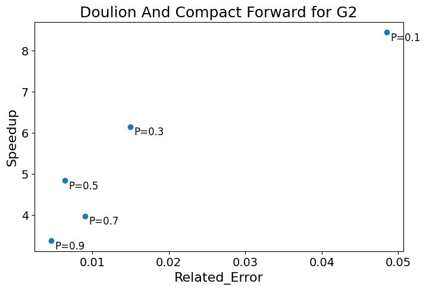
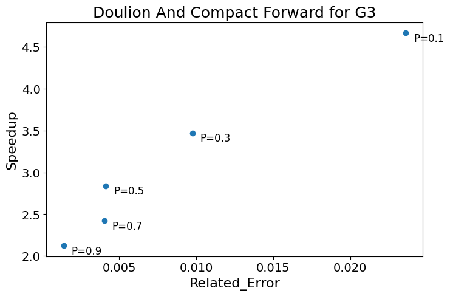
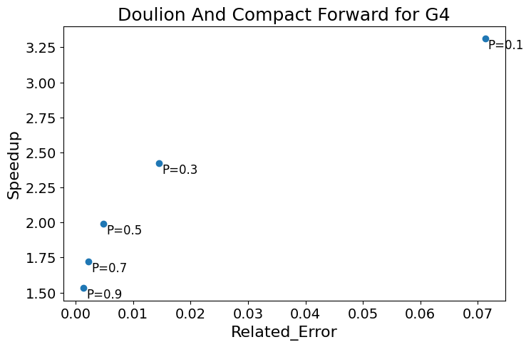

## Streaming Algorithm

### TRIEST for Edge Insertions

Implementing the Triest algorithm

```
def update_counters(sample, u, v, t, globalT, localT, M):
    # Update the global and local counters based on the new edge (u, v)
    neighbors_u = set(sample.neighbors(u)) if sample.has_node(u) else set()
    neighbors_v = set(sample.neighbors(v)) if sample.has_node(v) else set()

    common_neighbors = neighbors_u.intersection(neighbors_v)

    for w in common_neighbors:
        if random.random() <= M / t:
            globalT += 1
            localT[u] = localT.get(u, 0) + 1
            localT[v] = localT.get(v, 0) + 1
            localT[w] = localT.get(w, 0) + 1

    return globalT, localT
```
```
def sample_edge(sample, u, v, t, M):
    # Sample the edge (u, v) into the graph with probability M/t
    if random.random() <= M / t:
        return True
    return False
```
```
def triest_edge_insertion(file_path, M):

    globalT = 0
    localT = {}
    t = 0
    sample = nx.Graph()

    with open(file_path, 'r') as f:
        for line in f:
            t += 1
            u, v = map(int, line.strip().split())

            # Update counters and sample edge
            globalT, localT = update_counters(sample, u, v, t, globalT, localT, M)
            if sample_edge(sample, u, v, t, M):
                sample.add_edge(u, v)

    return globalT, localT
```
```
def triest(file_path,triangles, M_values):
    triest_accuracy_list = []
    # Example usage:
    graph = file_path  # Replace with the actual path to your graph file


    for M in M_values:
        global_triangles, local_triangles = triest_edge_insertion(graph, M)
        triest_accuracy = global_triangles / triangles
        print(f"M={M}: Global Triangle Count: {global_triangles}")
        #print(f"M={M}: Local Triangle Counts: {local_triangles}")
        print(f"M={M}: Accuracy: {triest_accuracy}")
        print("-------------------------------------------------")
        triest_accuracy_list.append(triest_accuracy)
    return triest_accuracy_list
```
```
M_values_g1 = [8800, 17600, 26400, 35200, 44000, 52800, 61600, 70400, 79200, 88234]  # Experiment with different values of M
g1_triest_accuracy = triest('facebook_combined.txt',triangles_g1, M_values_g1)
M_values_g2 = [9350, 18700, 28050, 37400, 46750, 56100, 65450, 74800, 84150, 93497]  # Experiment with different values of M
g2_triest_accuracy = triest('CA-CondMat.txt',triangles_g2, M_values_g2)
M_values_g3 = [92587, 185174, 277761, 370348, 462935, 555522, 648109, 740696, 833283, 925872]  # Experiment with different values of M
g3_triest_accuracy = triest('roadNet-CA.txt',triangles_g3, M_values_g3)
M_values_g4 = [277660, 555320, 832980, 1110640, 1388300, 1665960, 1943620, 2221280, 2498940, 2766607]  # Experiment with different values of M
g4_triest_accuracy = triest('com-amazon.ungraph.txt',triangles_g4, M_values_g4)
```

## Plotting metrics

```
def createplot_accuracy_triest(accuracy,alg,M,edges):
  plt.figure(figsize=(8, 5))
  percentage = []
  for value in M:
    percentage.append((value / edges)*100)
  plt.scatter(accuracy,percentage)

  for acc, perc in zip(accuracy, percentage):
        adjusted_acc = acc + 0.005  # You can adjust this value based on your preference
        adjusted_perc = perc - 0.005  # You can adjust this value based on your preference
        plt.text(adjusted_acc, adjusted_perc, f'{acc:.3f}', fontsize=8, verticalalignment='top', horizontalalignment='left')
  plt.scatter
  plt.xlabel('Accuracy', fontsize=16)
  plt.ylabel("% of total edges", fontsize=16)

  plt.title(alg, fontsize=18)
  plt.xticks(fontsize=14)
  plt.yticks(fontsize=14)
  plt.savefig(alg+"_GRQC.png", bbox_inches='tight',dpi=300) #saving the current figure (plot) as an image file.
  #plt.savefig(alg+"_roadCA.png", bbox_inches='tight',dpi=300)
  #plt.savefig(alg+"_CondMat.png", bbox_inches='tight',dpi=300)
  plt.show()
```
```
createplot_accuracy_triest(g1_triest_accuracy, 'Triest for G1',M_values_g1,88234)  
createplot_accuracy_triest(g2_triest_accuracy, 'Triest for G2',M_values_g2,93497)
createplot_accuracy_triest(g3_triest_accuracy, 'Triest for G3',M_values_g3,925872)
createplot_accuracy_triest(g4_triest_accuracy, 'Triest for G4',M_values_g4,2766607)
createplot_accuracy_triest(g5_triest_accuracy, 'Triest for G5',M_values_g5,5021410)  
```

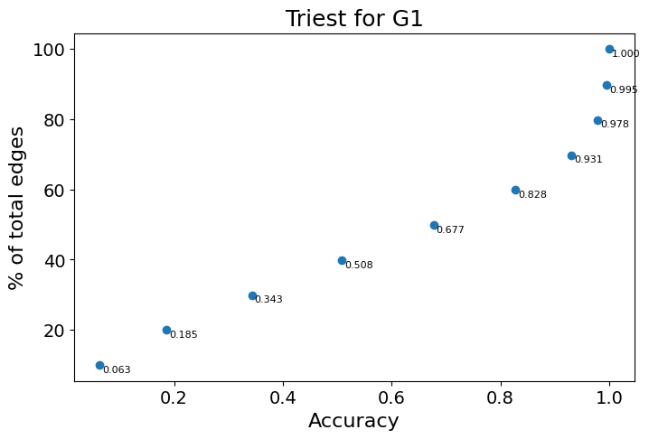
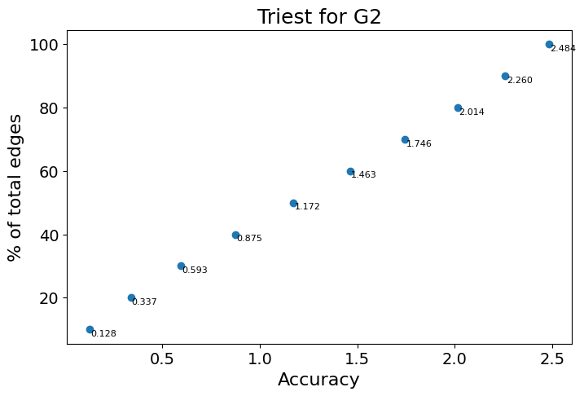
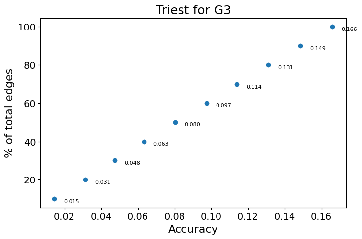
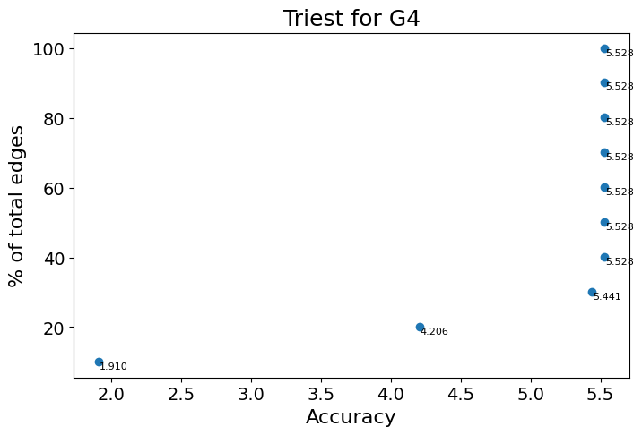
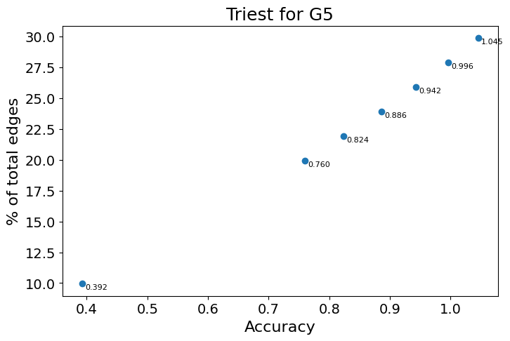
